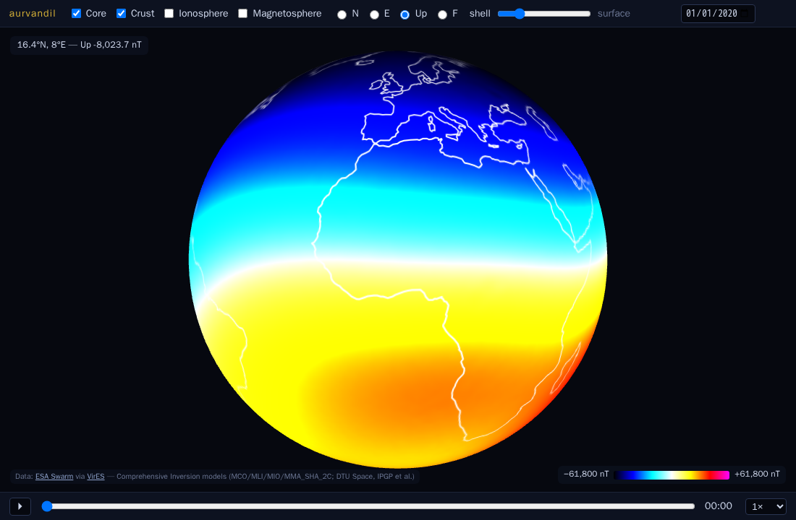

# geomag-model-explorer

Browser-based interactive 3D visualization of Earth's geomagnetic field —
core, crust, ionosphere and magnetosphere, from the Swarm Level-2
**Comprehensive Inversion (CI) model chain** (MCO_SHA_2C, MLI_SHA_2C,
MIO_SHA_2C, MMA_SHA_2C), evaluated via [VirES](https://vires.services)
and rendered on a three.js globe.



- **Field toggles** — any subset of the four contributions, summed on the GPU.
- **Component picker** — N / E / Up (= −C) / F.
- **Shell slider** — discrete precomputed radii from the core–mantle boundary
  (−2891 km) through 500 km mantle steps to the surface, then a unified
  0–1500 km altitude ladder at 100 km steps shared by every model, so any
  field combination is summable on any shell; translucent shells with a
  coastline reference sphere. Demo:
  `/#f=core,iono,magneto&c=Up&s=h300&t=12:00`.
- **Any-day date picker** — days are fetched from VirES on demand (a
  background job with progress UI; minutes for a new day) and cached forever;
  default 2020-01-01 is pre-fetched.
- **Bottom time bar** — 00:00–24:00 at 15-min cadence with playback, for the
  ionospheric daily cycle and fast magnetospheric variations.
- **Hover readout** — lat/lon + field value at full stored precision.
- **Shareable permalinks** — the view (day, time, fields, component, shell,
  camera) lives in the URL hash, e.g.
  `/#day=2020-01-01&t=12:00&f=core&c=N&s=cmb&cam=0.000,0.000,2.500`
  (feature-flagged; see below).
- **Study tabs** — *Daily* (the v1 view) and *Ionosphere (Seasonal)*, which
  plays a precomputed series instead of a day: the ionospheric Sq system
  sweeping through a year, weekly at 12:00 UT (the other models' toggles
  are disabled on this tab). Demo:
  `/#tab=seasons&series=mio-seasonal-2020&e=2020-07-01T12:00&f=iono&c=Up&s=surface`
  (feature-flagged: `studies`).
- **Sun overlay** — subsolar glyph + day/night terminator computed from the
  displayed UT, so playback reads as "the ionospheric dynamo follows the
  Sun". On a fixed-time-of-day series the terminator holds the series'
  clock while the date steps, instead of spinning through the days between
  epochs. Demos: `/#f=iono&c=Up&s=surface&t=12:00&sun=1`,
  `/#tab=seasons&series=mio-seasonal-2020&f=iono&c=Up&s=surface&sun=1`
  (feature-flagged: `sun`).
- **Relief mode** — the displayed scalar displaces the shell radially
  (signed: dents where negative; fixed exaggeration tied to the colorbar
  range) with a hillshade that the sun overlay lights when both are on.
  Demo: `/#f=crust&c=Up&s=surface&r=1` (feature-flagged: `relief`).
- **Model families** — a page-level *Model series* selector (Swarm CI /
  CHAOS) over per-source tabs: *Combined models* (the v1 view; under CHAOS
  it plays a curated day at 15-min cadence), *Core* with a **B ↔ dB/dt**
  toggle (secular variation in nT/yr, a yearly 2014–2023 series, derived
  as a centered ±6-month finite difference of the core model — at the CMB
  the downward-continued SV is spectacular), and *Ionosphere* (seasonal).
  CHAOS deliberately ships without an ionospheric layer — the toggle greys
  out and says why. Demos:
  `/#tab=core&series=core-secular&f=core-sv&c=Up&s=cmb`,
  `/#family=chaos&tab=daily&series=daily-2020-01-01@chaos&e=2020-01-01T12:00&f=core,crust,magneto&c=Up&s=h300`,
  `/#tab=core&series=core-secular@chaos&f=core-sv&c=Up&s=cmb`
  (feature-flagged: `families`).

## Layout

| | |
|---|---|
| `fetch.py` | the ONLY module that talks to the network (VirES via viresclient; Natural Earth coastline once) → `data/raw/*.npz`, provenance in `data/MANIFEST.toml` |
| `export.py` | npz → quantized int16 tiles (`web/data/…/tNN.i16`) + `web/data/manifest.json` (atomic publish) + textures |
| `serve.py` | starlette on :8212 — static frontend + tiles + day-fetch job API |
| `web/` | no-build frontend: ES modules + importmap, three.js vendored; flagged feature modules under `web/features/` |
| `features.json` | deploy-time feature flags, served at `/api/features`; a feature is dark until enabled here (PLAN v2.1 governance) |
| `deploy/` | systemd `--user` unit + portal handoff |

See `PLAN.md` for current state and next steps (full v1 design archived in
`HISTORY.md`) and
`RULES.md` for the workflow. `AGENTS.md` is the session primer.

## Run

```sh
uv sync                                   # serve/export deps
uv run --extra fetch python fetch.py --validity --static --assets
uv run --extra fetch python fetch.py --day 2020-01-01
uv run --extra fetch python fetch.py --series mio-seasonal-2020
uv run python export.py --static --day 2020-01-01
uv run python export.py --series mio-seasonal-2020
uv run uvicorn serve:app --port 8212      # http://localhost:8212/
```

VirES credentials live in `~/.viresclient.ini` (viresclient docs). The
`assets` extra (chaosmagpy/matplotlib) is only needed to regenerate the
committed textures (`export.py --assets`).

`GEOMAG_MODEL_EXPLORER_DATA=<dir>` relocates the data cache (raw + tiles) off the
checkout; the layout under it mirrors `data/` + `web/data/`.

## Tests

```sh
uv run pytest            # unit + API + browser (needs the service on :8212)
```

Browser tests run headless Chromium (Playwright) against the live service —
real interactions, zero console errors, screenshots in `tests/artifacts/`.

## Deploy

```sh
cp deploy/geomag-model-explorer-web.service ~/.config/systemd/user/
systemctl --user daemon-reload && systemctl --user enable --now geomag-model-explorer-web
```

Portal wiring (nginx at `/foundry/geomag-model-explorer/`): `deploy/PORTAL_HANDOFF.md`.

## Attribution

Field models: ESA Swarm Level-2 Comprehensive Inversion products
(DTU Space, IPGP et al.), served by VirES for Swarm. Coastlines: Natural
Earth (public domain). Colormap: `nio` from chaosmagpy.
